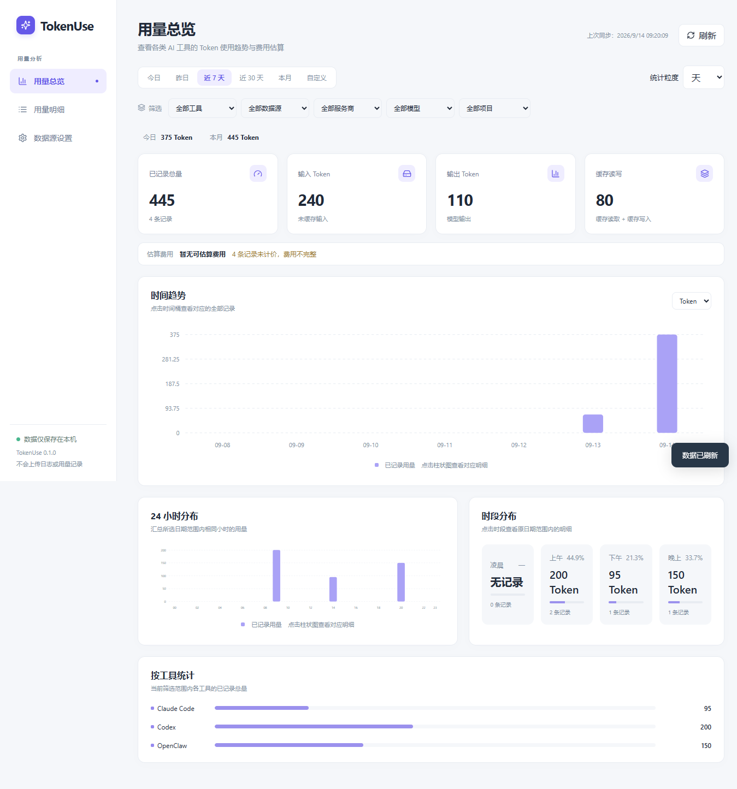

# TokenUse

把自己在 Codex、Claude Code 和 OpenClaw 上烧掉的 token 收成一张只放在本机的看板，顺便估估这个月大概花了多少钱。

支持 Windows 上的 Codex、Claude Code，以及 Windows / WSL 中 OpenClaw 的 JSONL 用量记录；Cursor 通过 CSV 导入。统计和配置只留在本机，不上传用量，也不需要填写 API Key。



## 运行

需要 Node.js 22.12 以上。

```powershell
npm.cmd ci
npm.cmd run dev
```

打出 Windows x64 便携版：

```powershell
npm.cmd run package
```

安装包写到 `release/`，不放进仓库。便携版是 `TokenUse-0.1.0-Windows.exe`，不需要安装 Node.js。`npm.cmd run package:dir` 会生成 `release/win-unpacked/TokenUse.exe`，使用时请保留整个 `win-unpacked` 文件夹。

首次启动不填入演示数据。在“数据源设置 → 日志来源”点击“检测本地数据源”，选择要添加的日志目录。可为来源选择默认服务商，点击“保存并刷新”。有大量历史记录时首次同步可能需要约一分钟，后续仅增量读取。

关闭窗口会最小化到托盘。要完全退出，在托盘图标上右键选择“退出”。应用运行时才会后台监测，首版不注册开机启动。

## 查看时段用量

- **今日 / 昨日**：默认按小时看趋势。
- **近 7 天 / 近 30 天 / 本月**：默认按日统计，可切换小时、日、周、月。
- **24 小时分布**：将选定日期范围内每天同一小时的用量合计。例如近 7 天的 09 时柱，表示这七天 09:00–10:00 的合计。
- **时段分布**：凌晨、上午、下午、晚上四个时段；点击查看相应明细。
- **自定义范围**：可选日期，也可开启精确时间。日期结束包含当天；精确结束时间不包含该时刻。

工具、来源、服务商、模型和项目筛选共同生效。周一作为一周开始。图表使用系统时区，UTC 时间保存在数据库内。只有日期的 CSV 行参与按日统计，不会被计入凌晨或小时明细。

## 中转站与价格

预置寒鹤中转站、晨光号中转站、Penguin API 和 DeepSeek 官方，支持新增、修改、停用。服务商配置与调用工具分开，一次调用不会因为同时属于一个工具和一个服务商而计数两次。

服务商网址和 API 地址作为可编辑资料保存，程序不会通过这些地址调用模型，也不会查询账户余额。无需填写 API Key。给已有日志指定中转站时，请先确认真实归属；程序不会仅根据模型名称猜测。

在“价格规则”中按服务商、模型、币种、生效日期设置每百万 Token 的输入、输出、缓存和推理单价。**空单价表示未知，0 表示免费。** 默认允许推理使用输出单价。费用是本地估算，来源申报费用在明细中单独显示，两者都不等于平台账单；不同币种不混加。每日峰谷价格不自动切换。

更改默认服务商只影响后续新记录。已有记录可以通过“调整历史归属”选择数据源、日期范围和服务商后修改。

## Cursor CSV

在“日志来源”选择“导入 CSV”，检查预览和列映射。至少需要时间及总 Token 或一个 Token 分项。可映射模型、缓存、费用等字段；带费用但没有币种列时，请明确填写默认费用币种。

无时区的时间使用导入界面选择的 IANA 时区，例如 `Asia/Shanghai` 或 `UTC`。程序记住该文件的时区，同一文件不能改用另一时区重复导入。

相同文件重复导入不会重复统计；没有记录 ID 的相同行按指纹去重并提示。不同 CSV 文件检测到重叠时，新来源默认不参与汇总，可在确认属于独立记录后修改“纳入汇总统计”。TokenUse 自己导出的 CSV 有标记，默认不能再次作为新用量导入。

## WSL

先在 Windows 启动需要使用的 WSL 发行版，再检测数据源。程序不会为了扫描而启动已停止的发行版。手动路径示例：

```text
\\wsl.localhost\Ubuntu-24.04\home\你的用户名\.openclaw\agents
\\wsl.localhost\Ubuntu-24.04\home\你的用户名\.claude\projects
```

WSL 未运行或路径不可读时，历史记录保留，并提示当前状态。本机目录约每 30 秒轮询并优先使用文件监视；WSL 约每 2 分钟刷新。可随时手动刷新。

## 数据完整性

界面展示**已记录用量**。没有日志或缺失字段不能证明实际消耗为零。

- Codex 某些会话可能没有用量事件；数据源会显示完整性提示。
- OpenClaw 只解析 JSONL，不读取其他版本的 SQLite 会话库。
- Cursor 首版只支持 CSV，尚未接入自动账户同步。
- RAG 项目、API 转发、账户余额、订阅额度和自动价格抓取不在首版范围内。
- 单次调用全部归入其用量事件时间，不能还原调用过程中逐分钟的实际消耗。
- 超过 32 MB 的单条 JSONL 行会跳过并提示，后续正常行继续读取。

配置和 SQLite 数据默认在 `%APPDATA%/tokenuse/`。源日志只读；数据库不保存对话正文、API Key 或登录态。应用没有云同步。备份时先从托盘退出，再复制该目录。删除应用程序不会自动删除统计数据。

## 开发与验证

```powershell
npm.cmd test
npm.cmd run build
node tests/electron-smoke.mjs
```

Electron 运行时首次使用时可能需要下载。网络无法访问默认下载源时，可按当地网络情况配置 `ELECTRON_MIRROR` 和 `ELECTRON_BUILDER_BINARIES_MIRROR`。

`tests/electron-smoke.mjs` 会用 `.test-data` 中独立的合成日志和数据库进行界面验收，不修改个人日志或默认统计库。设置 `TOKENUSE_PACKAGED_EXE` 为打包后的 `TokenUse.exe` 可验证发行目录。测试包含 CSV 文件选择和保存对话框的定向替换，其余解析、IPC、数据库和界面流程均使用实际实现。

设计在 `docs/superpowers/specs/`，实施计划在 `docs/superpowers/plans/`，验证结果见 `docs/验收报告.md`。
